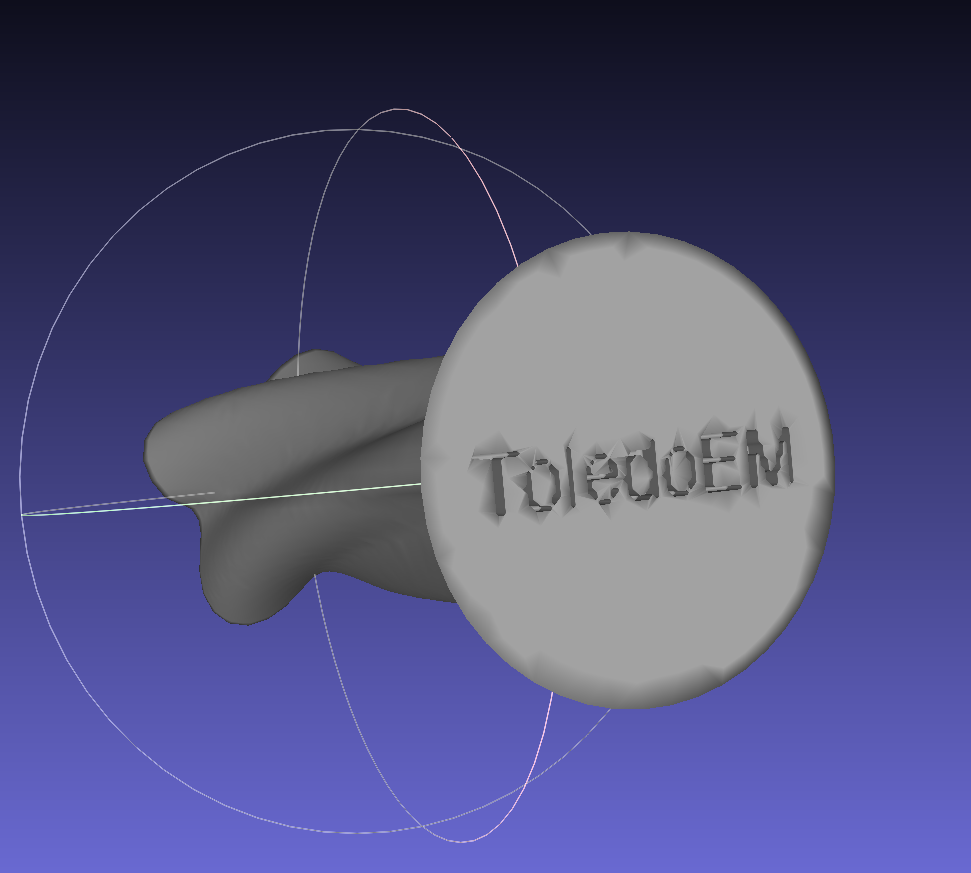

# STL Branding Tool

Carve text into STL 3D models programmatically with high-quality text rendering and automatic mirroring for bottom positioning.




## Features

- **Automatic Text Mirroring**: Text is automatically mirrored (rotated 180°) for correct reading when viewing from below
- **High-Resolution Text**: Uses 2x resolution rendering for smooth, clean text geometry
- **Font Fallback System**: Robust font loading with multiple fallback options
- **Binary STL Export**: Outputs compact binary STL files
- **Watertight Meshes**: Ensures proper boolean operations with hole filling and mesh validation
- **Bottom Position Only**: Simplified interface focused on the most common use case

## Installation

```bash
uv venv
source .venv/bin/activate
uv pip install trimesh numpy pillow scipy scikit-image
```

## Usage

### Single File

```bash
uv run python stl_brander.py input.stl output.stl "BRAND TEXT" [depth] [font_size]
```

Parameters:
- **text**: Text to carve (always positioned on bottom with mirroring)
- **depth**: carve depth in mm (default: 1.0)
- **font_size**: font size in points (optional, will auto-fit if not provided)

### Examples

```bash
# Basic usage with auto-fit font
uv run python stl_brander.py model.stl branded.stl "MyBrand"

# With specific depth
uv run python stl_brander.py model.stl branded.stl "MyBrand" 2.0

# With specific depth and font size
uv run python stl_brander.py model.stl branded.stl "MyBrand" 2.0 12
```

### Batch Processing

Edit configuration in `batch_carve.py`:

```python
BRAND_TEXT = "YOUR BRAND"
INPUT_FOLDER = "input_stls"
OUTPUT_FOLDER = "branded_stls"
TEXT_SCALE = 0.7
CARVE_DEPTH = 1.0
FONT_SIZE = None  # Font size in points (None for auto-fit)
# Note: All text is positioned on bottom with automatic mirroring
```

Run:

```bash
uv run python batch_carve.py
```

## Font System

The tool uses a robust font fallback system:

1. Custom font specified in constructor
2. `xkcd.ttf` (if available in current directory)
3. System fonts:
   - `/System/Library/Fonts/Helvetica.ttc`
   - `/Library/Fonts/Arial.ttf`
   - `/System/Library/Fonts/SFNSDisplay.ttf`
   - `/System/Library/Fonts/SFNS.ttf`
4. PIL default font (final fallback)

## Python API

```python
from stl_brander import STLBrander

brander = STLBrander()

brander.carve_text(
    input_stl="model.stl",
    output_stl="branded_model.stl",
    brand_text="YOUR BRAND",
    text_scale=0.7,
    carve_depth=1.0,
    font_size=100  # Optional: specific font size in points (None for auto-fit)
)
# Note: Text is automatically positioned on bottom with mirroring
```

### Batch Processing

```python
results = brander.batch_carve(
    input_files=["model1.stl", "model2.stl"],
    output_folder="branded_stls",
    brand_text="YOUR BRAND",
    carve_depth=1.0
)
# All files will have text on bottom with automatic mirroring
```

## Configuration

### Custom Font

```python
brander = STLBrander(font_path="/path/to/font.ttf")
```

### Text Positioning

- **Bottom Position Only**: Text is automatically rotated 180° for correct reading orientation when viewed from below
- **Simplified Interface**: Removed multiple position options to focus on the most common use case

Available positions: bottom, top, front, back, left, right

### Text Scale

Value between 0.0 and 1.0, relative to model dimensions.

## Files

- `stl_brander.py` - Main carving implementation
- `batch_carve.py` - Batch processing script

## Dependencies

- trimesh - STL file handling and mesh operations
- numpy - Numerical computations
- pillow - Text rendering
- scipy - Mesh processing utilities
- scikit-image - Image processing for text conversion

## Requirements

Python 3.9 or higher
